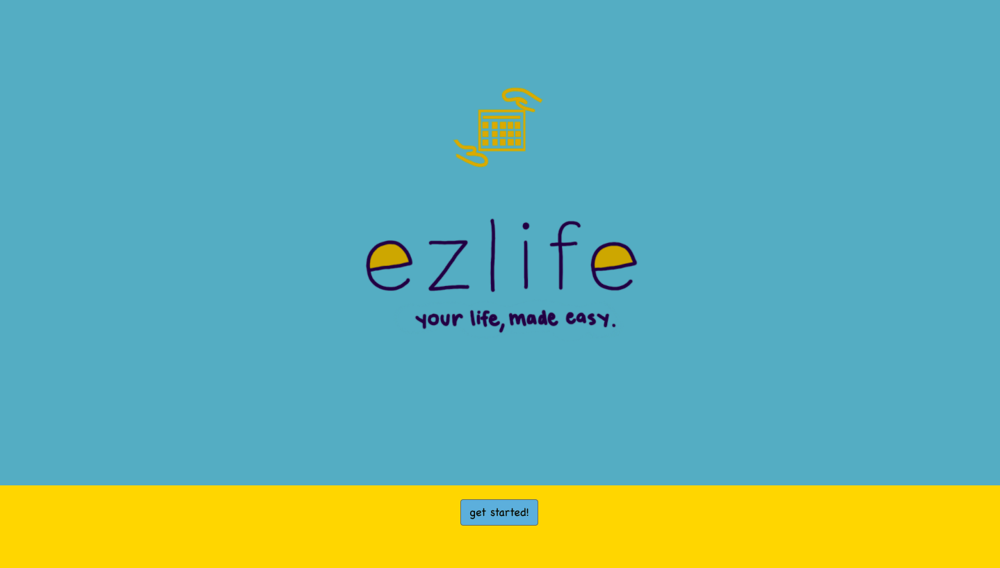
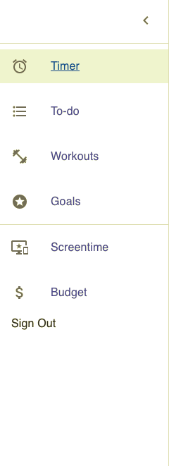

## Project Name: 
*ezlife*

## Table of Contents 

* [Purpose/Vision](#purpose/vision)

* [Code Style](#codestyle)

* [Screenshots](#screenshots)

* [Tech](#tech)

* [Features](#features)

* [Code Example](#codeexample)

* [Installation](#installation)

* [Api Reference](#apireference)

* [How to Use](#howtouse)

* [License](#license)

## Purpose/Vision

## Code Style

## Screenshots

 
 

## Tech

## Features

## Code Example

## Installation

## API Reference

## How To Use
* Sign up for an account on the sign in page or visit the login page to log in. 
* 

## License 
* Copyright @ ezlife 